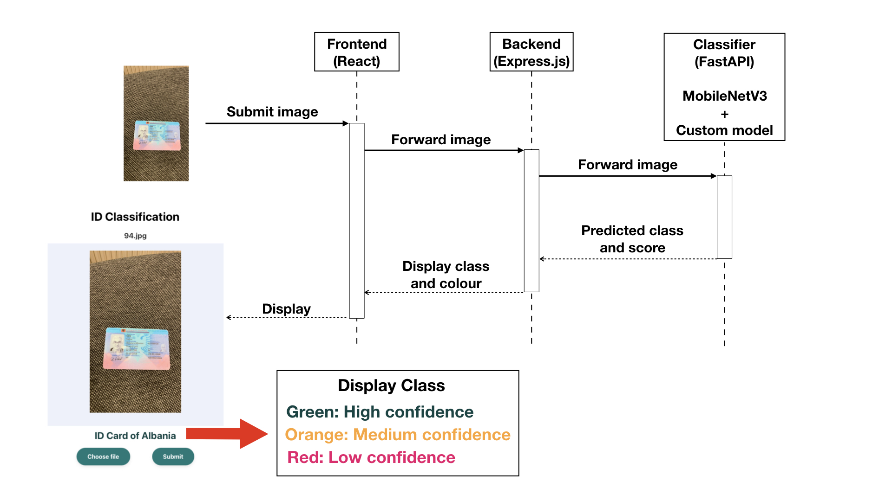

# ID Classification

Build and run in docker:

```
docker-compose up --build
```

## Overview

This application uses a combination of computer vision techniques to classify photo ID images submitted by users. 

Currently supported 10 IDs:
* ID Card of Albania
* Passport of Azerbaijan
* ID Card of Spain
* ID Card of Estonia
* ID Card of Finland
* Passport of Greece
* Passport of Latvia
* Internal passport of Russia
* Passport of Serbia
* ID Card of Slovakia


Here's a step-by-step overview of the app workflow:




1. The front end is built with React. A user submits an image through the interface.
2. Once an image is submitted, it is forwarded to the backend, which is built with Express.js.
3. The backend then sends the image to a classifier system that uses FastAPI to handle requests.
4. The classifier uses MobileNetV3 and a custom model to predict the class and score of the submitted image.
5. The predicted class and score are sent back to the backend.
6. The backend maps the predicted class to user-friendly words and transforms the prediction score into a colour. High confidence: above average true positive scores. Medium confidence: above one std lower than the average true positive scores. Low confidence: below one std lower than the average true positive score. Sends the processed information to the frontend.
7. The frontend displays the class with a colour indicating the confidence.

## Approach Explanation

- **Feature Extraction** Chosen MobileNet to take the advantage of the pretrained features and the fast inference time compared to other large models. Also, the resource requirement is low, allowing the application to run very fast on a CPU machine or mobile phone.
- **Model Training** After preprocessing the images to MobileNet's requirements, I added image rotation augmentation and used them to train a simple multilayer perceptron classification model, then predict their classes.
- **Architecture Design** I chose to separate the classifier from backend service so the classifier can focus on prediction and in the future if we want to enhance the application, we can save the images and prediction for future learning. Having a separate backend service can make the communication with database and other APIs more clearer, increasing maintainability and scalability. 


## Future Improvements

### Application
- **Frontend**: Enhancements could include a more organized layout and component-based structure.
- **Concurrency**: Implement threading or other concurrency mechanisms to support multiple users simultaneously.
- **Security**: Create security layers against potential fraudulent attempts and encrypt images during transmission. 

### Classifier
- **Unknown Class**: Introduce a dedicated class to handle submissions that do not belong to any of the supported classes. 
- **Data Augmentation**: Explore additional methods like rescaling, cropping, and noise injection.
- **Model Complexity**: Consider larger models for improving accuracy and implement cross-validation to ensure robustness across different unseen data.
- **Research**: Stay updated with the latest research in image classification to continuously improve the model's performance.